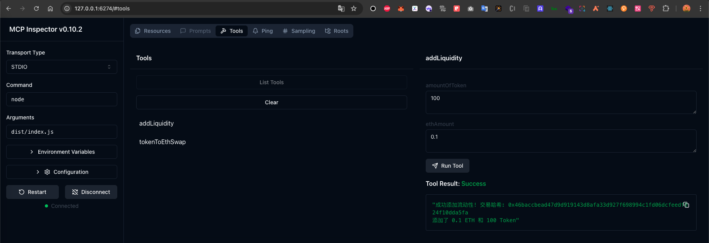
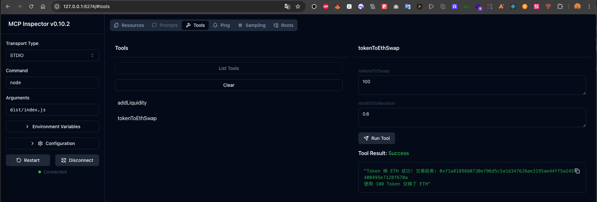
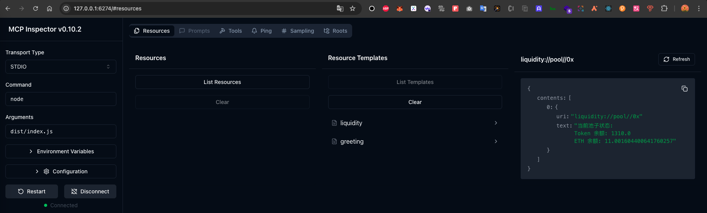

#### deploy uniswap
git clone https://github.com/baidang201/Uniswap-V1
cd Uniswap-V1
yarn
npx hardhat node
"node deploy"  or  "yarn test"

#### run mcp serve

yarn

yarn build && npx @modelcontextprotocol/inspector node dist/index.js

##### addLiquidity

##### tokenToEthSwap

##### resource pool
